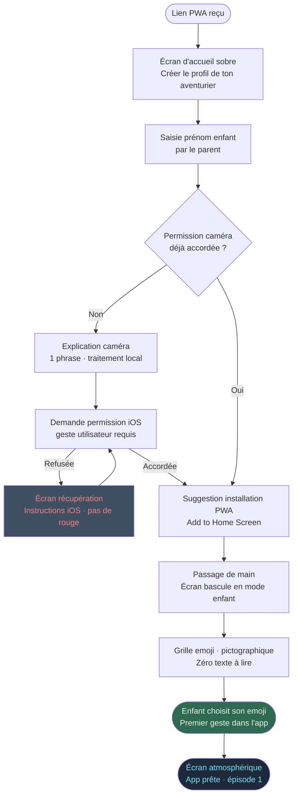
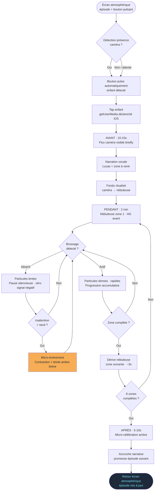
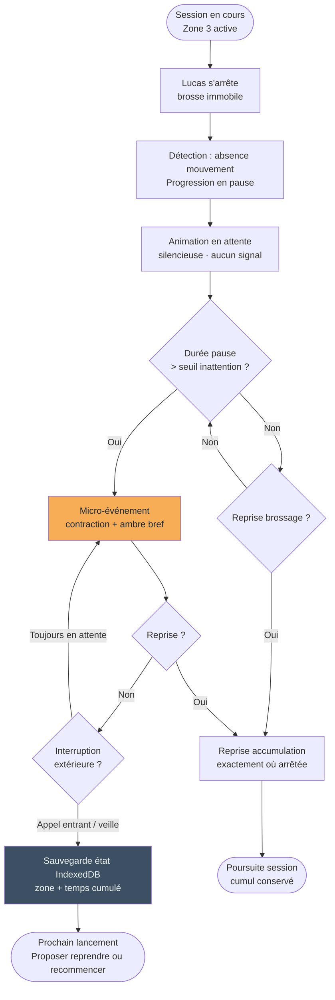
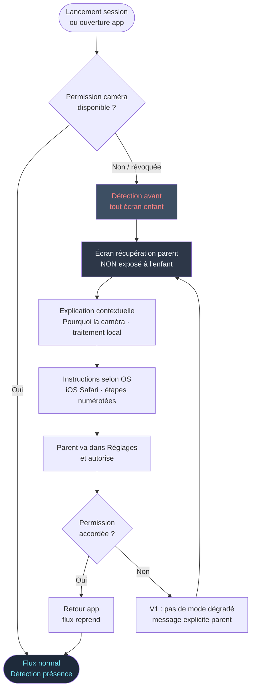

# Spécification UX — BrossQuest

**Auteur :** Romain
**Date :** 2026-03-24

---

## Executive Summary

### Vision Produit

BrossQuest est une PWA conçue pour les enfants de 6 à 10 ans qui transforme le brossage quotidien en aventure narrative. Le geste réel de brossage — détecté via MediaPipe Hands (traitement 100% on-device) — pilote directement la progression de l'histoire. L'app n'oriente pas l'attention vers l'écran : elle l'oriente vers les dents, en utilisant une animation abstraite comme guide implicite plutôt que comme destination.

### Utilisateurs Cibles

**Utilisateur principal — L'Enfant Aventurier (6–10 ans)**
Profil : Lucas, 6 ans. Brosse mécaniquement sans conscience des zones, pas encore lecteur courant, impatient. Le succès se mesure au renversement de l'initiative : l'enfant réclame l'app avant que le parent propose.

**Utilisateur secondaire — Le Parent Gestionnaire (30–45 ans)**
Profil : Sandrine ou Thierry, soir ou matin chargé, pas forcément tech-friendly. Le succès : lancer l'app en moins de 10 secondes, poser le téléphone, revenir deux minutes plus tard.

### Défis de Design Clés

1. **Friction de démarrage nulle** — Chaque écran superflu entre "ouvrir l'app" et "brossage actif" est un point de friction critique. KPI non négociable : ≤ 10 secondes
2. **Dual persona sur le même appareil** — L'interface bascule entre mode parent (textuel, sobre) et mode enfant (pictographique, animé). Le "passage de main" est le moment UX le plus délicat du produit
3. **Animation guide sans compétition** — L'animation abstraite doit orienter le regard vers les dents, pas le capter vers l'écran. L'équilibre présence/discrétion est le challenge de design central de la phase "Pendant"
4. **Erreurs invisibles pour l'enfant** — Toute friction technique (permission caméra, détection dégradée, IndexedDB vide) doit être absorbée côté parent, jamais exposée à l'enfant

### Opportunités de Design

1. **Le passage de main comme signature UX** — Ce rituel onboarding peut devenir un différenciateur mémorable et émotionnel de l'expérience
2. **Un vocabulaire visuel narratif propre** — Le couplage narration "Avant" / animation abstraite "Pendant" permet de construire un langage visuel unique qui encode les zones dentaires sans carte froide
3. **La séquence comme confort rituel** — La structure Avant/Pendant/Après répétée quotidiennement est une opportunité de créer un confort prédictible qui réduit la charge cognitive et renforce l'attachement

## Expérience Utilisateur Core

### Action Centrale

L'action la plus fréquente et la plus critique : lancer une session de brossage depuis l'écran d'accueil. Tout le produit converge vers ce moment — un tap, la caméra s'active, l'histoire commence. Cette action doit être irréductible : 0 décision, 0 texte à lire, 1 geste.

L'écran d'accueil doit être lisible par un enfant non-lecteur de 6 ans agissant seul — après 2 à 3 semaines d'usage, c'est l'enfant qui peut tendre la main vers le téléphone avant le parent.

### Stratégie Plateforme

PWA mobile portrait uniquement. iOS Safari P0 (iPhone posé sur rebord de lavabo), Android Chrome P1. Offline-first après première installation. Interface 100% tactile, conçue pour une main occupée par une brosse à dents. Pas de breakpoint desktop. Deux orientations portrait supportées (standard + inversé).

### Interactions Invisibles

- Détection de présence à l'approche → bouton de lancement pulsant activé automatiquement
- Passage caméra → animation par fondu calibré — ni trop rapide (le flux caméra a une valeur rituelle : l'enfant se voit, s'ancre dans le moment) ni trop long (concurrence avec l'animation)
- Détection du décrochage → micro-événement d'animation sans feedback explicite
- Progression entre quadrants → glissement implicite, jamais annoncé
- Détection matin/soir → ton narratif adapté sans action utilisateur

### Moments Critiques

| Moment | Ce qui doit se passer | Ce qui tuerait l'expérience |
|---|---|---|
| Premier lancement | Onboarding ≤ 3 min, passage de main réussi | Écran d'erreur caméra face à l'enfant |
| Première session | La narrative avance grâce au brossage | Aucune réaction visible pendant 30 secondes |
| 3e lancement | Signal de reconnaissance "content de te revoir" — ton narratif légèrement différent | Expérience identique au premier jour, sans ancrage |
| Premier décrochage | L'animation pulse doucement → l'enfant reprend | Message d'avertissement ou son négatif |
| Détection incertaine | Seuil calibré : ni trop haut (histoire bloquée malgré un vrai brossage), ni trop bas (progression sans geste réel) | Frustration ou tromperie — les deux brisent la promesse |
| Lancement quotidien | < 10 secondes, aucune décision parent | Demande de mise à jour, reconnexion, choix |
| Retour parent en fin de session | Signal discret "ça s'est bien passé" — pas un rapport, une sensation | Rien → le parent ne sait pas si la session était bonne |

### Principes d'Expérience

1. **Le brossage est le moteur, pas le timer** — l'histoire n'avance que si l'enfant bouge sa brosse. Ce n'est pas une contrainte, c'est la mécanique de jeu
2. **La technologie disparaît** — la caméra s'efface après un fondu ritualisé, la détection est silencieuse, les erreurs techniques restent côté parent. L'enfant vit une histoire, pas une interaction avec une app
3. **Bienveillance absolue encodée** — aucune pénalité, aucun son négatif, aucune progression perdue, aucune notification. Cette philosophie n'est pas un ton éditorial, c'est une contrainte de design
4. **Deux personas, un seul appareil** — l'interface parent et l'interface enfant sont deux produits distincts qui cohabitent. Le "passage de main" est la frontière cérémonielle entre eux
5. **La voix comme identité** — la narration vocale "Avant" avec le prénom de l'enfant est l'élément le plus intime du produit. La qualité, la chaleur et le rythme de cette voix sont un choix UX fondamental, pas un détail de production

## Réponses Émotionnelles Désirées

### Objectifs Émotionnels Primaires

**Pour l'enfant — l'agentivité** : le sentiment d'être l'auteur de l'histoire, pas spectateur. Chaque mouvement de brosse fait quelque chose dans le monde narratif. L'émotion centrale : « c'est moi qui fait avancer mon dragon ».

**Pour le parent — la confiance calme** : pas d'excitation, pas de surprise — la certitude tranquille que ça fonctionne sans lui. L'émotion centrale : « je peux poser le téléphone ».

### Cartographie Émotionnelle du Parcours

| Moment | Enfant | Parent |
|---|---|---|
| Onboarding | Curiosité → appropriation (« c'est mon emoji ») | Scepticisme → soulagement (ça s'installe vite) |
| Première session | Émerveillement (« l'histoire avance quand je brosse ») | Surprise discrète (il brosse vraiment ?) |
| 3e session | Anticipation (« je veux savoir la suite ») | Confiance installée (routine sans négociation) |
| Décrochage → reprise | Réengagement doux, sans honte | — |
| Fin de session | Fierté légère + curiosité pour la prochaine fois | Satisfaction calme |
| Semaine 3–4 | Appartenance (« mon dragon ») | Étonnement de voir l'enfant demander l'app |

### Micro-Émotions Critiques

- **Confiance vs méfiance** → le fondu caméra→animation signifie implicitement "rien n'est enregistré" ; l'explication parent pendant l'onboarding lève l'ambiguïté explicitement
- **Accomplissement vs frustration** → le seuil de détection est une décision émotionnelle autant que technique : trop strict = histoire bloquée → frustration ; trop laxiste = progression sans effort → sentiment de vide
- **Appartenance vs indifférence** → l'emoji choisi, le prénom prononcé, "son" univers — chaque détail ancre l'enfant comme protagoniste
- **Calme vs anxiété** → aucun son négatif, aucune couleur d'alerte, aucun compte à rebours visible. L'esthétique globale est apaisante même pendant le guidage

### Implications de Design

| Émotion cible | Décision de design |
|---|---|
| Agentivité de l'enfant | La causalité brossage→animation doit être perceptible dès la première session |
| Confiance du parent | Explication caméra en une phrase ; fondu caméra→animation comme signal implicite |
| Appartenance | Prénom dans la narration vocale ; emoji persistent sur l'écran d'accueil |
| Calme universel | Palette sourde, animations lentes, sons doux — micro-célébration proportionnée |
| Curiosité narrative | Chaque fin de session laisse une accroche ouverte — promesse de suite, pas résolution |

### Émotions à Éviter

- **Honte / culpabilité** — aucun signal si l'enfant s'arrête, aucun visage déçu, aucun streak cassé
- **Anxiété de performance** — pas de score, pas de comparaison, pas de jauge de "brossage parfait"
- **Dépendance au reward** — la micro-célébration est proportionnée, jamais excessive

## Analyse UX & Inspirations

### Analyse des Produits Inspirants

#### Disney Magic Timer — L'Anti-Modèle Documenté

Disney Magic Timer est utilisé par les familles cibles, mais sans conviction. L'analyse terrain révèle le problème systémique :

| Symptôme observé | Ce que ça révèle |
|---|---|
| Enfant immobile, brosse en bouche | L'app a capturé l'attention vers l'écran — victoire sur les dents |
| Parents qui cachent l'écran | Solution spontanée qui prouve que l'app aggrave le problème qu'elle prétend résoudre |
| Usage uniquement pour les bonus de fin | La gamification récompense la durée, pas le geste — le comportement de brossage ne change pas |
| Trop de contenu disponible | Friction de démarrage parentale élevée → l'app devient un effort, pas une routine |

Disney Magic Timer est la validation inverse de BrossQuest : chaque problème qu'il crée est une contrainte de design que BrossQuest résout par construction.

#### Apple Watch "Pleine Conscience" — L'Inspiration Centrale

L'exercice de respiration de l'app Pleine conscience watchOS est le paradigme UX le plus proche de BrossQuest :

- Une forme abstraite qui "gonfle et dégonfle" guide un geste corporel sans instruction textuelle
- L'animation **est** l'instruction — pas une récompense, pas une distraction, un signal corporel
- Le corps suit naturellement le visuel sans effort cognitif conscient
- Aucun score, aucune comparaison, aucune pression — juste la durée finie et le retour au calme
- La sensation corporelle (respiration) reste au centre — l'écran est un métronome, pas une destination

**Le transfert direct vers BrossQuest :** l'animation abstraite des zones est ce métronome visuel corporel. Elle se déplace lentement d'une zone à l'autre en s'enfonçant progressivement vers l'intérieur, et la main de l'enfant suit — sans effort cognitif explicite. La narration "Avant" décode la zone à venir ; l'animation la rend perceptible en temps réel ; le corps suit.

### Modèle de Zones — Architecture 8 Segments

Au lieu des 4 quadrants classiques, BrossQuest adopte un modèle à 8 zones (4 quadrants × avant/arrière) pour ~15 secondes chacune = 2 minutes exactes :

```
Haut-gauche-avant  → Haut-gauche-arrière
Haut-droit-avant   → Haut-droit-arrière
Bas-gauche-avant   → Bas-gauche-arrière
Bas-droit-avant    → Bas-droit-arrière
```

**Encodage visuel de la profondeur**
La transition avant → arrière n'est pas annoncée. L'animation devient progressivement plus dense, plus "intérieure" — une intensité visuelle centripète qui signale le passage vers les molaires sans instruction explicite. Inspiré du paradigme watchOS Breathe : l'animation "s'enfonce" comme une respiration qui va plus loin.

**Découverte progressive, pas récompense**
Les zones arrière ne se "débloquent" pas — elles ont toujours été là. L'enfant les découvre à force de répétition, comme une pièce cachée qui existait depuis le début. La narration "Avant" peut graduellement nommer "le fond du château" après quelques sessions — révélant ce que l'enfant percevait déjà visuellement sans le savoir.

**Cohérence avec la philosophie produit**
Zéro pénalité si l'enfant ne perçoit pas encore les zones arrière — la profondeur visuelle invite sans imposer. Compatible avec bienveillance absolue et zéro-annonce.

### Patterns UX Transférables

**Pattern central — Le métronome visuel corporel**
Une animation abstraite guide un geste physique sans instruction froide. Le visuel encode l'action sans la nommer. Transférer directement à l'animation des 8 zones.

**Pattern — Durée finie et prévisible**
L'utilisateur sait que l'exercice a une fin. Cette prévisibilité réduit l'anxiété et permet l'engagement. Transférer : la session de 2 minutes avec sa structure Avant/Pendant/Après bien délimitée.

**Pattern — Retour au calme post-exercice**
L'app Pleine conscience se termine sur un signal de clôture doux, pas sur un score. Transférer : la micro-célébration BrossQuest — proportionnée, calme, avec accroche narrative plutôt que reward.

**Pattern — Abstraction comme liberté de projection**
La forme abstraite watchOS ne représente pas concrètement la respiration — elle invite l'esprit à projeter. Transférer : l'animation abstraite BrossQuest laisse l'enfant projeter l'histoire décodée par la narration "Avant".

### Anti-Patterns à Éviter

- **Gamification par accumulation** (Disney Magic Timer) — récompenser la durée sans valider le geste crée un comportement de contournement
- **Surcharge de contenu** — trop de choix au démarrage transforme une routine en décision
- **Score et comparaison** — toute métrique visible crée de l'anxiété de performance
- **Animation narrative figurative pendant le brossage** — une animation avec personnages/actions capte le regard vers l'écran. L'abstraction est une contrainte de design, pas un compromis esthétique
- **Son comme signal de zone** — briser le silence de la phase "Pendant" crée une distraction qui concurrence le geste

### Stratégie d'Inspiration Design

**Adopter directement**
- Le paradigme "métronome visuel corporel" de l'app Pleine conscience : animation abstraite → guide corporel implicite
- La structure durée finie + clôture douce sans score
- L'abstraction volontaire comme outil de projection narrative

**Adapter**
- La cadence "gonfle/dégonfle" (respiration) → mouvement spatial + centripète entre 8 zones (brossage)
- Le signal de fin watchOS → micro-célébration BrossQuest avec accroche narrative

**Éviter**
- Toute gamification visible (Disney Magic Timer)
- Animation figurative pendant la phase "Pendant"
- Architecture d'app multi-niveaux visible dès le lancement

## Fondation Design System

### Choix du Système de Design

**Architecture hybride : Tailwind CSS + Canvas custom**

BrossQuest est structurellement deux produits dans une app :
- **Écrans parent** (onboarding, profil, récupération erreurs) : peu nombreux, sobre, textuel — fondation Tailwind CSS suffisante
- **Session enfant** (bouton pulsant, flux caméra, animation 8 zones, micro-célébration) : canvas animé 100% custom, aucun composant UI standard

### Rationale

- Aucune bibliothèque de composants (MUI, Chakra, Ant Design) ne couvre le cœur de l'expérience — la session est un canvas, pas une UI
- Tailwind fournit les design tokens (couleurs, espacements, typographie) sans overhead sur les composants non utilisés
- Solo developer : éviter toute dépendance lourde à maintenir
- Cohérence visuelle assurée par les tokens, pas par des composants partagés

### Stratégie d'Implémentation

**Tailwind CSS** — tokens globaux, écrans parent, micro-célébration
**Canvas API / CSS animations** — animation abstraite des 8 zones, fondu caméra, micro-événements réactifs
**Composants custom minimaux** — bouton pulsant de lancement, sélecteur d'emoji, écran de profil

### Tokens de Design Prioritaires

- **Palette** : couleurs sourdes, pas de rouge ni de couleurs d'alerte
- **Typographie** : lisible par un parent fatigué et un enfant non-lecteur
- **Animations** : courbes lentes (ease-in-out), jamais abruptes
- **Espacements** : zones tactiles ≥ 44×44px (Apple HIG)

## Expérience Définissante

### Définition

> "Brosse tes dents — et ton histoire avance."

L'enfant fait le lien lors de la première session : le mouvement de sa brosse est le moteur de l'histoire. Pas un timer, pas un bouton, pas une récompense — le geste lui-même. C'est la seule interaction qui compte.

### Modèle Mental Utilisateur

**Enfant** : arrive avec le modèle mental des jeux ("si j'appuie, il se passe quelque chose") → découvre que c'est son geste qui commande, pas son doigt. Cette inversion se produit lors de la première session, sans explication.

**Parent** : arrive avec le scepticisme Disney Magic Timer ("mon enfant va regarder l'écran"). BrossQuest doit contredire cette attente dès le premier lancement — la preuve est dans l'observation de l'enfant qui déplace sa brosse.

### Critères de Succès de l'Expérience Core

- La causalité brossage→animation est perçue dans les 20 premières secondes
- Le parent peut poser le téléphone et partir sans instruction supplémentaire
- L'enfant déplace sa brosse d'une zone à l'autre sans qu'on le lui demande
- À la fin de la session, l'enfant parle de ce qu'il a vu (l'histoire), pas de ce qu'il a fait (le brossage)

### Patterns UX — Novel vs. Établi

| Composante | Type | Approche |
|---|---|---|
| Lancement par tap unique | Établi | Bouton pulsant — aucune éducation nécessaire |
| Détection caméra → progression narrative | Novel | La causalité s'apprend par l'expérience, pas par une explication |
| Animation abstraite comme guide spatial | Novel | Narration "Avant" indispensable comme décodeur |
| Passage de main parent→enfant | Novel | Fluide et mémorable sans notice d'utilisation |
| Micro-événement réactif à l'inattention | Novel | Invisible — l'enfant ne sait pas que l'app le perçoit |

### Mécanique de l'Expérience

**INITIATION**
Parent ouvre l'app → sélectionne le profil → pose le téléphone.
Caméra détecte l'enfant → bouton pulsant apparaît automatiquement.
Enfant tape → getUserMedia déclenché (geste utilisateur requis iOS Safari).

**AVANT (10–15s)**
Flux caméra visible : l'enfant se voit avec sa brosse — ancrage corporel.
Narration vocale avec prénom : mise en scène de la zone à venir.
Fondu ritualisé caméra → animation (~3s).

**PENDANT (2 min = 8 zones × ~15s)**
Animation abstraite dans le quadrant actif.
Brossage détecté → animation progresse.
Brossage absent → animation en attente, silencieuse, sans signal négatif.
Inattention détectée → micro-événement : intensité pulse brièvement.
Transition zone avant→arrière : animation s'épaissit, devient centripète.

**APRÈS (5–10s)**
Micro-célébration visuelle proportionnée.
Accroche narrative vers le prochain épisode.
Retour à l'accueil — l'app "disparaît".

## Fondation Visuelle

### Système de Couleurs — Direction "Profondeur des mondes"

**Fonds**

| Token | Valeur | Usage |
|---|---|---|
| bg-session | #1E2A3A | Écran session enfant |
| bg-parent | #2D3748 | Écrans parent / UI |
| bg-surface | #3D4F63 | Cards, zones secondaires |

**Textes**

| Token | Valeur | Usage |
|---|---|---|
| text-primary | #EDF2F7 | Texte principal |
| text-secondary | #A0AEC0 | Labels, métadonnées |
| text-muted | #718096 | Éléments discrets |

**Animation session**

| Token | Valeur | Usage |
|---|---|---|
| anim-avant | #48BB78 | Zones avant (incisives, prémolaires) |
| anim-arrière | #2D6A4F | Zones arrière (molaires) — profondeur encodée par saturation |
| anim-transition | #38A169 | Glissement avant→arrière |
| anim-micro | #F6AD55 | Micro-événement d'attention (ambre chaud, non alarmant) |

**Accents**

| Token | Valeur | Usage |
|---|---|---|
| accent-cyan | #76E4F7 | Bouton pulsant, onboarding, sélection emoji |
| accent-ambre | #F6AD55 | Micro-célébration, accroche narrative |
| accent-erreur | #FC8181 | Erreurs parent uniquement — jamais face à l'enfant |

**Règles absolues** : pas de rouge vif, pas de noir pur (#000000), jamais une couleur d'erreur ou d'alerte dans le flux enfant.

### Système Typographique

**Police unique : Inter (variable)**
Sobre pour le parent, lisible à grande taille pour l'enfant. Zéro texte pendant la phase Pendant — tout est visuel.

| Contexte | Poids | Taille | Usage |
|---|---|---|---|
| Titre parent | 700 | 24px | En-têtes onboarding |
| Corps parent | 400 | 15px | Instructions, labels |
| Titre session enfant | 700 | 32px | Nom univers, accueil |
| Emoji sélecteur | — | 64px | OS natif, pas de fonte |

Taille minimale : 14px (parent) · 18px (enfant)
Contraste cible : ≥ 4.5:1 (WCAG AA)

### Espacements & Layout

Unité de base : 4px (grille Tailwind)
Zones tactiles : min 44×44px — cible 56×56px côté enfant

**Layout parent** : centré, max-width 390px, padding horizontal 24px, une seule action principale par écran
**Layout session** : 100vw × 100vh plein écran, zéro chrome visible, safe areas iOS respectées (env(safe-area-inset-*))

| Token | Valeur | Usage |
|---|---|---|
| space-xs | 4px | Séparation fine |
| space-sm | 8px | Espace interne composant |
| space-md | 16px | Padding standard |
| space-lg | 24px | Espace entre sections |
| space-xl | 40px | Marges écran |
| space-2xl | 64px | Espaces onboarding |

Rayon de bordure : 16px cards · 24px boutons principaux · 50% bouton pulsant

### Considérations d'Accessibilité

- Contraste texte ≥ 4.5:1 sur tous les écrans parent (WCAG AA)
- Zones tactiles ≥ 44×44px (Apple HIG) sans exception
- Navigation par icônes et animation côté enfant — jamais par texte seul
- Feedback sonore et visuel combinés (sauf phase Pendant : visuel seul)
- Aucune couleur d'alerte dans le flux enfant

## Décision de Direction Design

### Directions Explorées

8 écrans générés et revus en panel. Retours clés intégrés avant validation :

- **Écran 3 revu** : la grille de 8 zones est abandonnée — carte dentaire déguisée. Remplacée par une nébuleuse organique unique dont le déplacement spatial encode les zones et la densité encode la profondeur.
- **Écran 7 supprimé** : l'écran d'accueil parent quotidien ("Lancer l'aventure") est une friction inutile. L'app s'ouvre directement sur l'écran atmosphérique.

### Direction Retenue

**Base : Écran atmosphérique** comme écran d'accueil quotidien.
Fond étoilé / ardoise profond, titre de l'épisode en cours, bouton pulsant.
Accès parent via icône discrète — 1 tap, jamais sur le chemin de l'enfant.

**Animation session :** nébuleuse organique avec système de particules.
La vélocité MediaPipe pilote en temps réel la densité et la vitesse des particules.
Position de la nébuleuse = zone active (dérive spatiale lente).
Densité/saturation = profondeur (plus compact + sombre = zones arrière).

### Rationale

- Zéro friction quotidienne : l'enfant (ou le parent) ouvre l'app et voit immédiatement l'épisode qui attend. 1 tap = session lancée.
- L'animation répond au geste — la causalité est perceptible dès la première session sans explication.
- L'accès parent est là quand on en a besoin, invisible quand on n'en a pas besoin.

### Architecture Écrans Post-Onboarding

| Moment | Écran | Initiateur |
|---|---|---|
| Ouvre l'app | Atmosphérique + titre épisode + bouton pulsant | Enfant ou parent |
| Tap bouton | Phase Avant (caméra brief + narration) | Enfant |
| Session | Nébuleuse organique 8 zones | Enfant |
| Fin session | Phase Après (célébration + accroche) | Auto |
| Besoin parent | Icône discrète → nom / emoji / stats pause | Parent |

### Spécification Animation Nébuleuse

La phase Pendant est un canvas plein écran. La nébuleuse :

- **Position** : dérive lente entre 8 positions spatiales (4 quadrants × avant/arrière)
- **Avant** : nébuleuse étendue, vert #48BB78, particules rapides et légères
- **Arrière** : nébuleuse contractée, vert profond #2D6A4F, particules plus lentes et denses
- **Réactivité** : vélocité MediaPipe → densité particules en temps réel
- **Micro-événement** : inattention détectée → contraction + teinte ambre #F6AD55 brève
- **Transition zone** : dérive organique ~3s entre positions, jamais abrupte

## Parcours Utilisateurs — Flows de Design

### Parcours 1 — Onboarding parent + Passage de main

**Entrée :** parent reçoit un lien PWA direct
**Succès :** enfant a choisi son emoji, app installée, prête à lancer



### Parcours 2 — Session nominale (Lucas, soir)

**Entrée :** écran atmosphérique — épisode en cours visible
**Succès :** session complète, micro-célébration, accroche narrative



### Parcours 3 — Décrochage et reprise (Lucas fatigué)

**Entrée :** session en cours, Lucas s'arrête après 40 secondes
**Succès :** reprise sans pénalité, session complète ou partielle sauvegardée



### Parcours 4 — Récupération permission caméra (Thierry)

**Entrée :** parent refuse la permission par réflexe, ou iOS révoque silencieusement
**Succès :** permission accordée, session enfant démarre normalement



### Patterns de Parcours

**Navigation :** écran unique actif à la fois — pas de navigation à onglets, pas de retour arrière pendant la session, accès paramètres uniquement via icône discrète hors session.

**Décision :** les seules décisions utilisateur sont : tap pour lancer (enfant), choix emoji (enfant, une fois), accès paramètres (parent, rare). Tout le reste est automatique.

**Feedback :** toujours visuel et discret. Jamais de modale bloquante face à l'enfant. Les erreurs remontent côté parent uniquement.

**Reprise :** état de session sauvegardé en temps réel (IndexedDB). Perte de données impossible sauf vide cache — géré par onboarding de récupération rapide.

### Principes d'Optimisation des Flows

1. **Zéro décision superflue** — chaque étape automatisable l'est (détection présence, détection horaire)
2. **Dégradation gracieuse** — chaque erreur technique a un chemin de récupération qui ne bloque pas l'enfant
3. **Progression cumulative** — aucun état ne se perd, la session reprend exactement là où elle s'est arrêtée
4. **Bascule invisible** — le passage mode parent → mode enfant est une transition visuelle, pas une action explicite

## Stratégie Composants

### Composants Fondation (Tailwind)

Usage limité aux écrans parent sobres : champ texte, bouton primaire, card, étapes numérotées. Aucune bibliothèque de composants externe — Tailwind pur.

### Composants Custom

| Composant | Persona | Criticité | Phase |
|---|---|---|---|
| `PulseButton` | Enfant | ★★★ | Alpha |
| `NebulaCanvas` | Enfant | ★★★ | Alpha |
| `EmojiPicker` | Enfant | ★★★ | Alpha |
| `NarrativeCard` | Enfant / Parent | ★★★ | Alpha |
| `CameraFade` | Enfant | ★★★ | Alpha |
| `CelebrationOverlay` | Enfant | ★★ | Alpha |
| `ParentAccessIcon` | Parent | ★★ | Alpha |
| `PermissionRecovery` | Parent | ★★ | Alpha |
| `ProfileSettings` | Parent | ★ | Final |

### Spécifications Critiques

**`PulseButton`** — Cercle centré, animation radial pulse CSS.
États : `idle` · `presence-detected` (pulse accéléré) · `tapped` → fondu session.
Taille ≥ 120×120px. Déclenche getUserMedia au tap (requis iOS Safari).

**`NebulaCanvas`** — Canvas HTML5 plein écran, système de particules.
Inputs : zone active (1–8) · vélocité MediaPipe · état attention.
Zones avant : #48BB78 dispersé · Zones arrière : #2D6A4F dense et contracté.
Micro-événement inattention : teinte ambre #F6AD55 · durée 800ms.
Zéro interaction tactile — lecture seule.

**`EmojiPicker`** — Grille 4×2 · 64px · zéro texte.
Un seul emoji sélectionnable. Haptic feedback si disponible.

**`NarrativeCard`** — Écran atmosphérique avec fond étoilé CSS.
Titre épisode · PulseButton centré · icône parent discrète (opacité 40%).

**`CameraFade`** — Gère la transition flux caméra → NebulaCanvas.
Fondu CSS ~3s · ease-in-out · libère le flux vidéo après transition complète.

### Stratégie d'Implémentation

- Composants custom construits avec les tokens Tailwind
- `NebulaCanvas` : Canvas API + requestAnimationFrame — pas de bibliothèque d'animation externe
- Chaque composant testable en isolation (spike NebulaCanvas indépendant du reste de l'app)

### Roadmap d'Implémentation

**Phase Alpha — Composants bloquants**
`NebulaCanvas` · `CameraFade` · `PulseButton` · `EmojiPicker` · `NarrativeCard` · `PermissionRecovery`

**Phase Final — Polish**
`CelebrationOverlay` · `ProfileSettings` · `ParentAccessIcon` (simplifié en Alpha)

## Patterns UX de Consistance

### Hiérarchie des Boutons

Un écran = une décision = un CTA principal. Jamais deux actions de même poids.

| Niveau | Apparence | Usage |
|---|---|---|
| Primaire | accent-cyan plein · radius 24px · 56px hauteur | CTA onboarding, paramètres |
| PulseButton | Cercle cyan · radial pulse · ≥ 120px | Lancement session uniquement |
| Secondaire | bg-surface · bordure subtile | Actions secondaires onboarding |
| Fantôme | Texte accent-cyan seul | Liens textuels parent |
| Destructif | Absent en V1 | — |

### Patterns de Feedback

Le silence est un feedback valide — il encode la bienveillance absolue.

| Situation | Pattern | Interdit |
|---|---|---|
| Brossage actif | Particules denses · NebulaCanvas | Badge, compteur, son |
| Pause | Particules lentes · silence total | Son négatif, alerte visuelle |
| Micro-événement | Teinte ambre #F6AD55 · 800ms | Pop-up, vibration forte |
| Fin session | CelebrationOverlay proportionné | Score, étoiles, pourcentage |
| Erreur parent | Texte + icône accent-erreur #FC8181 | Rouge vif, modale bloquante |
| Succès onboarding | Transition visuelle douce | Toast, confetti, son |

### Patterns de Formulaires

Usage : onboarding parent uniquement. Un champ par écran quand possible.

- Champ texte : fond `bg-surface` · label fixe au-dessus · focus bordure `accent-cyan`
- Validation inline après blur uniquement — jamais en temps réel
- Message d'erreur en `accent-erreur` sous le champ, jamais en modale

### Patterns de Navigation

Application à flux linéaire — pas de navigation classique.

```
Onboarding → NarrativeCard → Session → NarrativeCard
                  ↕
           [icône parent] → ProfileSettings
```

Pas de barre de navigation · pas d'onglets · pas de menu hamburger.
Retour arrière OS : désactivé pendant session, natif hors session.
`ProfileSettings` : fermeture par swipe bas ou bouton retour OS.

### Patterns d'États Spéciaux

| État | Pattern |
|---|---|
| IndexedDB vide (cache effacé) | Onboarding récupération rapide · pas d'erreur brute |
| MediaPipe en chargement | PulseButton apparaît quand prêt · zéro spinner visible |
| Détection dégradée (éclairage) | Signal discret côté parent · enfant non interrompu |
| Mise à jour PWA disponible | Différée fin de session · invisible pendant session |

## Responsive Design & Accessibilité

### Stratégie Responsive

BrossQuest est conçu comme une **application portrait exclusivement mobile**. Cette contrainte est une décision de design, pas une limitation technique : l'expérience de brossage avec la caméra frontale n'a de sens qu'en portrait, tenu en main ou posé sur un rebord.

**Mobile portrait (P0)** — Toute l'expérience est optimisée pour ce contexte. Résolution cible : iPhone SE (375 × 667px) comme plancher, iPhone 16 Pro Max (430 × 932px) comme plafond. L'app doit fonctionner sans dégradation sur toute cette plage.

**Portrait inversé** — Supporté passivement. Certains enfants retournent le téléphone ; l'app ne doit pas casser. Aucun écran spécifique n'est conçu pour ce cas.

**Tablette** — Fonctionnel non optimisé. La PWA s'affiche en colonne centrée sur tablet. Aucune mise en page spécifique prévue pour le V1.

**Desktop** — Hors scope. Page d'erreur minimaliste orientant vers mobile si accès depuis navigateur desktop.

**Paysage (landscape)** — Bloqué activement pendant la session de brossage (caméra frontale inutilisable). Hors session : géré par la rotation naturelle du système, sans adaptation dédiée.

### Stratégie de Breakpoints

Pas de breakpoints classiques pour cette application. La logique responsive repose sur :

- **`max-width: 390px`** — ajustement de taille de police et d'espacement pour iPhone SE et équivalents Android compacts
- **Safe areas iOS** — `env(safe-area-inset-top)` et `env(safe-area-inset-bottom)` appliqués systématiquement pour éviter les chevauchements avec la Dynamic Island et la barre home
- **`100dvh`** — hauteur de viewport dynamique (Dynamic Viewport Height) plutôt que `100vh` pour absorber les barres de navigation iOS Safari variables
- **`viewport-fit=cover`** dans le meta viewport pour déborder sous les encoches et îlots dynamiques

Aucun breakpoint tablet ou desktop dans le CSS de production V1.

### Stratégie d'Accessibilité

Pas d'engagement WCAG formel pour le V1 — la nature de l'app (enfants 6–10 ans, interaction caméra temps réel) rend certaines exigences WCAG inapplicables ou contreproductives. La stratégie repose sur des **contraintes fonctionnelles non négociables** :

**Contraste et lisibilité**
- Contraste ≥ 4.5:1 pour tout texte parent (interface sobre sur `#2D3748`)
- Interface enfant intentionnellement non textuelle — les exigences de contraste texte ne s'appliquent pas aux animations NebulaCanvas
- PulseButton : ratio contraste `#48BB78` sur `#1E2A3A` ≥ 4.5:1 vérifié

**Zones tactiles**
- Minimum 44×44px pour tous les éléments interactifs parent
- PulseButton enfant : minimum 120×120px (zone de tap élargie, pas seulement le visuel)
- Grille emoji (passage de main) : cellules ≥ 56×56px

**Navigation enfant non-lectrice**
- Aucune action enfant ne requiert de lecture — pictogrammes exclusifs hors contexte narratif audio
- NarrativeCard : texte narratif accessoire, jamais instruction critique

**Médias et caméra**
- `<video playsinline>` obligatoire sur iOS — sans cet attribut, la caméra s'ouvre en plein écran natif et casse l'expérience
- `autoplay` + `muted` pour les animations d'introduction sans interaction utilisateur
- Alt text sur toutes les images statiques de l'interface parent

**Pas prévu en V1 :** support lecteur d'écran sur l'interface enfant (NebulaCanvas), navigation clavier complète, mode contraste élevé.

### Stratégie de Tests

**Spike MediaPipe (pré-développement)**
Avant toute ligne d'interface, valider que MediaPipe Hands WASM fonctionne dans iOS Safari 16+ avec un budget mémoire acceptable. C'est le risque technique #1 du projet.

**Appareils de référence**
- iPhone SE (2e génération, iOS 16) — appareil plancher, résolution minimale, RAM contrainte
- iPhone 14/15 — cible principale
- Android mid-range (Samsung Galaxy A35 ou équivalent) — validation Chrome Android
- Tests sur vrai appareil exclusivement pour la session de brossage — les simulateurs ne reproduisent pas le comportement caméra

**Tests navigateur**
- iOS Safari : P0, obligatoire
- Android Chrome : P1, obligatoire avant lancement
- Firefox Mobile, Samsung Internet : P2, best effort
- Aucun test desktop navigateur en V1

**Budget performance**
- Cache PWA < 30 Mo (Service Worker)
- Démarrage ≤ 10 secondes sur réseau 4G standard
- MediaPipe : ≤ 50ms de latence de détection en conditions normales

**Accessibilité fonctionnelle**
- Test manuel contraste sur les deux interfaces (parent + enfant)
- Vérification zones tactiles sur iPhone SE en conditions réelles (doigts enfant ≠ doigt adulte)
- Test rotation portrait/paysage sur chaque écran

### Directives d'Implémentation

**Responsive**
```css
/* Meta viewport obligatoire */
<meta name="viewport" content="width=device-width, initial-scale=1, viewport-fit=cover">

/* Hauteur dynamique */
min-height: 100dvh;

/* Safe areas */
padding-top: env(safe-area-inset-top);
padding-bottom: env(safe-area-inset-bottom);

/* Breakpoint compact uniquement */
@media (max-width: 390px) {
  /* Ajustements taille de police et espacement */
}
```

**Unités relatives**
- Police : `rem` exclusivement (base 16px)
- Espacement : tokens Tailwind (`p-4`, `gap-6`) — jamais `px` hardcodé
- Canvas NebulaCanvas : dimensions calculées en JS via `window.innerWidth / window.innerHeight` × `devicePixelRatio`

**Canvas haute résolution**
```javascript
// Éviter le flou sur écrans Retina
canvas.width = container.clientWidth * window.devicePixelRatio;
canvas.height = container.clientHeight * window.devicePixelRatio;
ctx.scale(window.devicePixelRatio, window.devicePixelRatio);
```

**Vidéo caméra iOS**
```html
<!-- Sans playsinline : la caméra s'ouvre en plein écran natif sur iOS -->
<video autoplay muted playsinline></video>
```

**Blocage rotation pendant session**
```javascript
// Via Screen Orientation API quand disponible
if (screen.orientation?.lock) {
  screen.orientation.lock('portrait').catch(() => {});
}
// Fallback CSS
@media (orientation: landscape) {
  .session-screen { display: none; }
  .landscape-blocker { display: flex; }
}
```
